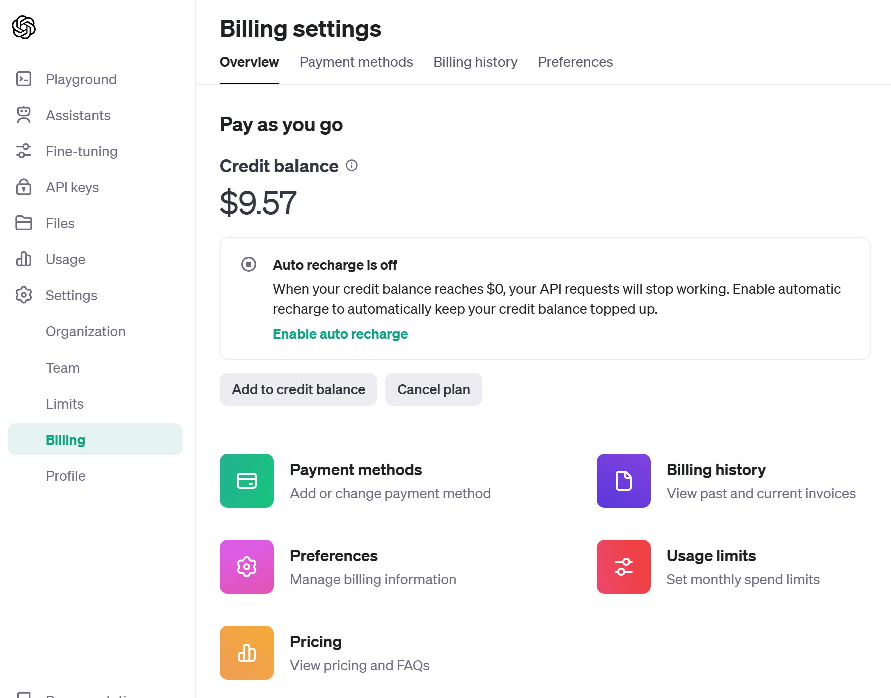

# Azure AI and Semantic Kernel Workshop
Workshop content for CodeMash 2024.

**In order to follow along with the workshop you will need to do the following things:**

- Install .NET 8 and Visual Studio 2022 v17.8 or higher
- Create an Azure account, an **Azure AI Services** resource, and get its **key** and **endpoint**.
- Create an OpenAI API account, add a balance to it, and **get an API key** for that account.

Some of these activities will take time to complete and should be done before the workshop.

## Prerequisites

- [Install the .NET 8 SDK](https://dotnet.microsoft.com/en-us/download/dotnet/8.0)
- [Visual Studio 2022](https://visualstudio.microsoft.com/downloads/) 
	- You must be on v17.8.0 or higher to use .NET 8
    - Note: Rider or VS Code _should_ work as well, but the workshop was developed and tested for Visual Studio 2022 which needs v17.8+ for .NET 8 support
- Clone the [git repository](https://github.com/IntegerMan/MattEland.AI.Semantic.Workshop) locally
	- Be sure to pull the latest changes before the workshop

You should be able to open and build the `CodeMashAIWorkshop.sln` solution in Visual Studio 2022 if everything is installed correctly.

### Azure Setup

In order to follow along with parts 1 and 2 of the workshop, you will need an Azure account with an Azure AI Services resource. 

#### Creating an Azure account

Create an Azure account if you do not have one already. I recommend creating a [free Azure Account](https://azure.microsoft.com/en-us/free/) if you are able to, but paid accounts will work as well.

NOTE: Parts of this workshop will make calls to your Azure resources which will incur some [costs on a per-use basis](https://azure.microsoft.com/en-us/pricing/calculator/?ef_id=_k_7189bd4eed8e1189cb09d8c29758101f_k_&OCID=AIDcmm5edswduu_SEM__k_7189bd4eed8e1189cb09d8c29758101f_k_&msclkid=7189bd4eed8e1189cb09d8c29758101f) 

#### Creating an Azure AI Services Resource

Once you have an Azure account, sign in to the [Azure Portal](https://portal.azure.com) and create a new resource.

You'll want to create an **Azure AI Services** resource, ideally in the **East US** region. See [Microsoft Learn](https://learn.microsoft.com/en-us/azure/ai-services/multi-service-resource?tabs=windows&pivots=azportal) for more information, but this will also be demonstrated during the workshop.


You'll need to specify a few important pieces of information:

- Your Azure AI Services **name** - this must be unique across all of Azure
- The **resource group** you want this to be created in. I recommend creating a new CodeMash2024 resource group you can delete later.
- **The Azure Region** - I recommend **US East** for network performance and to ensure you have the latest features
- **The pricing tier** - Free is great if available for low volume usage, but standard works fine too. Again, small charges will occur on a per-use basis.
- Specify you've read and agreed to Microsoft's terms

Once this is complete, review and create and then create your resource.

### OpenAI Setup

In order to work with parts 2 - 4 of the workshop, you'll need an OpenAI API account. **This takes some time to activate, so do this ahead of the workshop**!

Navigate to [platform.OpenAI.com](https://platform.openai.com) and choose to **sign up**.


Authenticate with whatever means you prefer and provide any additional information OpenAI requires.

Next log in and then click on **settings** on the left sidebar and then choose **Billing**


Alternatively, you can navigate directly to [https://platform.openai.com/account/billing/overview](https://platform.openai.com/account/billing/overview).

Next, add credits to your balance. I recommend between $5 and $10 for the workshop and some experimentation afterwards. Again, this will incur charges on your provided credit card and calling the API will deduct from your available credit balance.



**Important Note: There is a delay between adding credits to your account and when the API recognizes you have a positive balance. Add credits *before* the workshop in order to follow along!**

### Config File Setup

Once you have your Azure AI Services resource and an OpenAI account with a positive credit balance, you're ready to configure the application to use these values.

Open the `CodeMashAIWorkshop.sln` solution in Visual Studio and find the `appsettings.json` file. It should look something like the following:

```json
{
  // WARNING: These keys should be kept secret. Do not share them in public or commit them to source control.
  // SERIOUSLY: If you do commit keys to source control, others can use them to incur charges on your behalf. Revoke any shared keys immediately!
  // NOTE: Using Azure and OpenAI will result in charges to your Azure and/or OpenAI accounts.
  "OpenAI": {
    // You'll need to generate this key in your OpenAI account and wait 5-10 minutes for it to become active
    "Key": "",
    // These match the names of the models in OpenAI
    "TextModel": "gpt-3.5-turbo-instruct",
    "ChatModel": "gpt-4",
    "EmbeddingModel": "text-embedding-ada-002",
    "ImageModel": "dall-e-3"
  },
  "AzureAIServices": {
    // These values can be found on your Keys and Endpoint blade in your Azure AI Services resource
    "Key": "",
    "Endpoint": "",
    "Region": "eastus",
    // More voice options at https://learn.microsoft.com/en-us/azure/ai-services/speech-service/language-support?tabs=stt#supported-languages"
    "VoiceName": "en-GB-AlfieNeural"
  }
}
```

In order for the workshop to work properly, we'll need to set values for your Azure AI Services resource and your OpenAI account.

#### Azure AI Services Settings

In the `AzureAIServices` section, you'll need to specify the `Key` and `Endpoint` values as well as the `Region`.

These values can be found in the [Azure Portal](https://portal.azure.com) by navigating to the **Azure AI Services** resource you created earlier, then clicking on the **Keys and Endpoint** blade as shown here:


If you created your Azure AI Services resource in the **US East** region as suggested, the `eastus` value is correct for you and will not need to be changed.

Important Note: For the workshop, the easiest way of configuring the application is to put the values directly in the `appsettings.json` file. However, the key and endpoint should be considered sensitive information that should not be stored in source control since it will allow others to use your resources at your literal expense.

The application has been configured to look for values in the user secret files and in environment variables prefixed with `CODEMASH_SK_` for those more comfortable working with user secrets. However, you could also work entirely with the `appsettings.json` file as long as it is not shared or checked into source control later.

#### OpenAI Settings

Next you'll need to create an API key for OpenAI and set this value into the `Key` property for the `OpenAI` object in the `appsettings.json` file.

*Note: there's also an option for Azure OpenAI in the config file but this service is still behind a waitlist, so the workshop will use OpenAI instead of Azure OpenAI*

To generate an OpenAI Key, navigate to the **API Keys** section at [https://platform.openai.com/api-keys](https://platform.openai.com/api-keys).

From there, generate a new key with a descriptive name for the key. I recommend including a reference to this workshop for future reference.


Copy the key value to your clipboard and paste it into the `Key` property in the `OpenAI` element in `appsetttings.json`. This key value will not be viewable later in OpenAI. Also note that **there is a small delay after creating a new key and the key being usable. It is strongly recommended to set up keys before the workshop starts.**

---

Once you have your Azure AI Services key and endpoint and your OpenAI key in the config file, you are ready to go!